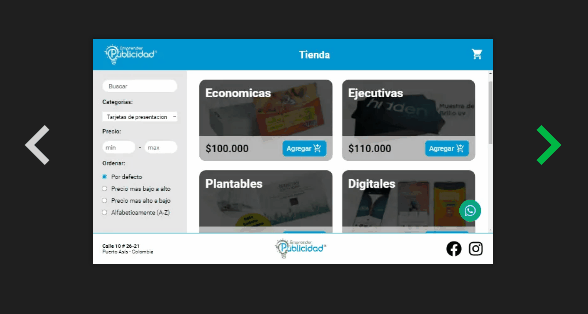

# Mi portafolio

Bienvenido a la magia detras de mi protafolio, aca veras como fue realizado, sus scripts, estructura y tecnologias usadas para su creacion.

## Tecnologias

Para la realizacion de este proyecto se ultilizaron las siguientes tecnologias:

- react - libreria de diseño UI
- next js - framework de react para produccion
- redux - manejo de estados globales
- gsap - animaciones
- netlify - despliegue

## Animaciones 3d

Se hizo uso de las propiedas de transformacion 3d de css.

- Perspectiva para el contenedor de los objectos 3d:

        perspective: 1200px;

- Estilo de transformaciones para que preserve el 3d:

        transform-style: preserve-3d;

- Y por ultimo tranformaciones incluyendo el eje z:

        transform: translateZ(calc(var(--w) / 2 * -1));

    ademas el uso de custom properties mas la funcion <code>calc()</code> para hacer el cubo 3d responsive en celulares

- Gsap se ultilizo en esta ocacion para modificar las tranformaciones de rotacion del cubo desde el codigo al dar click a la flecha

        const newRot = rot.current + (90 * r)
        gsap.to(".box", {
            rotateY: newRot,
            duration: .4
        })

## Dynamic import

Se utilizo dinamic de next.js para hacer imports de los iconos que estan en las habilidades, ya que se generan dinamicamente e importan el icono que nececitan sin traer todos los iconos de la libreria.

         const Icon = dynamic(() => import('react-icons/si').then(icons => icons[iName]))

despues solo utilizamos la variable como un componente y lo renderizamos, asignandole un tamaño

        <Icon size={25}/>

## En desarrollo...

- implementar envio de correo
- alertas al enviar correo
- al dar al boton de descargar hoja de vida, que la descargue, ya que aun no esta hecha
- cargar mas proyectos
- cargar mas certificados

